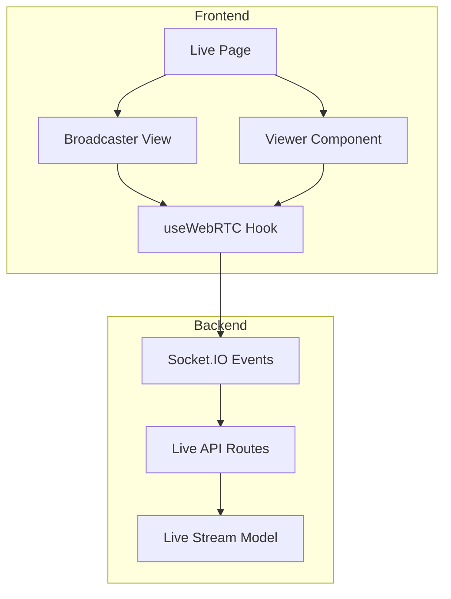

# Live Streaming Feature Plan

## Overview

Implement a one-to-many live streaming feature for Clockit using WebRTC for video streaming and Socket.IO for real-time communication.

## Architecture



## 1. Database Schema - Live Stream Model

**File**: `backend/src/models/LiveStream.js`

```javascript
const mongoose = require('mongoose');

const liveStreamSchema = new mongoose.Schema({
  streamId: {
    type: String,
    required: true,
    unique: true,
    index: true
  },
  host: {
    type: mongoose.Schema.Types.ObjectId,
    ref: 'User',
    required: true
  },
  title: {
    type: String,
    required: true,
    maxlength: 200
  },
  description: {
    type: String,
    maxlength: 1000
  },
  status: {
    type: String,
    enum: ['live', 'ended'],
    default: 'live'
  },
  viewers: [{
    user: {
      type: mongoose.Schema.Types.ObjectId,
      ref: 'User'
    },
    joinedAt: Date,
    leftAt: Date
  }],
  peakViewers: {
    type: Number,
    default: 0
  },
  duration: {
    type: Number, // in seconds
    default: 0
  },
  isPrivate: {
    type: Boolean,
    default: false
  },
  thumbnail: String,
  tags: [String],
  startedAt: {
    type: Date,
    default: Date.now
  },
  endedAt: Date
}, {
  timestamps: true
});

// Index for querying active streams
liveStreamSchema.index({ status: 1, startedAt: -1 });

module.exports = mongoose.model('LiveStream', liveStreamSchema);
```

## 2. Backend API Routes

**File**: `backend/src/routes/live.js`

### Endpoints

| Method | Endpoint | Description |
|--------|----------|-------------|
| POST | `/api/live/start` | Start a new live stream |
| POST | `/api/live/end/:streamId` | End a live stream |
| GET | `/api/live/active` | Get all active streams |
| GET | `/api/live/:streamId` | Get stream details |
| GET | `/api/live/user/:userId` | Get user's streams |
| POST | `/api/live/:streamId/view` | Record viewer join |
| POST | `/api/live/:streamId/comment` | Add live comment |

### Controller - `backend/src/controllers/liveController.js`

```javascript
const LiveStream = require('../models/LiveStream');
const { v4: uuidv4 } = require('uuid');

// Start a new live stream
const startLiveStream = async (req, res) => {
  try {
    const { title, description, isPrivate, tags } = req.body;
    const streamId = uuidv4();

    const liveStream = new LiveStream({
      streamId,
      host: req.user.id,
      title,
      description,
      isPrivate,
      tags,
      startedAt: new Date()
    });

    await liveStream.save();

    // Emit socket event to notify followers
    const io = req.app.get('io');
    io.emit('live_started', {
      streamId,
      title,
      host: {
        id: req.user.id,
        username: req.user.username,
        avatar: req.user.avatar_url
      },
      startedAt: liveStream.startedAt
    });

    res.status(201).json(liveStream);
  } catch (error) {
    console.error('Error starting live stream:', error);
    res.status(500).json({ error: 'Failed to start live stream' });
  }
};

// End a live stream
const endLiveStream = async (req, res) => {
  try {
    const { streamId } = req.params;

    const liveStream = await LiveStream.findOne({ streamId });
    if (!liveStream) {
      return res.status(404).json({ error: 'Stream not found' });
    }

    if (liveStream.host.toString() !== req.user.id) {
      return res.status(403).json({ error: 'Not authorized to end this stream' });
    }

    liveStream.status = 'ended';
    liveStream.endedAt = new Date();
    liveStream.duration = Math.floor((liveStream.endedAt - liveStream.startedAt) / 1000);
    await liveStream.save();

    // Notify all viewers
    const io = req.app.get('io');
    io.to(`live_${streamId}`).emit('live_ended', { streamId });

    res.json(liveStream);
  } catch (error) {
    console.error('Error ending live stream:', error);
    res.status(500).json({ error: 'Failed to end live stream' });
  }
};

// Get all active streams
const getActiveStreams = async (req, res) => {
  try {
    const streams = await LiveStream.find({ status: 'live' })
      .populate('host', 'username display_name avatar_url')
      .sort({ startedAt: -1 });

    res.json(streams);
  } catch (error) {
    console.error('Error fetching active streams:', error);
    res.status(500).json({ error: 'Failed to fetch streams' });
  }
};

// Get stream details
const getStreamDetails = async (req, res) => {
  try {
    const { streamId } = req.params;

    const stream = await LiveStream.findOne({ streamId })
      .populate('host', 'username display_name avatar_url bio');

    if (!stream) {
      return res.status(404).json({ error: 'Stream not found' });
    }

    res.json(stream);
  } catch (error) {
    console.error('Error fetching stream details:', error);
    res.status(500).json({ error: 'Failed to fetch stream' });
  }
};

// Record viewer join
const joinStream = async (req, res) => {
  try {
    const { streamId } = req.params;
    const { userId } = req.body;

    const stream = await LiveStream.findOne({ streamId });
    if (!stream || stream.status !== 'live') {
      return res.status(404).json({ error: 'Stream not found or ended' });
    }

    // Update viewer count
    const currentViewerCount = stream.viewers.filter(v => !v.leftAt).length + 1;
    if (currentViewerCount > stream.peakViewers) {
      stream.peakViewers = currentViewerCount;
    }

    // Add or update viewer
    const existingViewer = stream.viewers.find(v => v.user.toString() === userId);
    if (existingViewer) {
      existingViewer.joinedAt = new Date();
      existingViewer.leftAt = null;
    } else {
      stream.viewers.push({
        user: userId,
        joinedAt: new Date()
      });
    }

    await stream.save();

    res.json({ success: true, viewerCount: currentViewerCount });
  } catch (error) {
    console.error('Error joining stream:', error);
    res.status(500).json({ error: 'Failed to join stream' });
  }
};

module.exports = {
  startLiveStream,
  endLiveStream,
  getActiveStreams,
  getStreamDetails,
  joinStream
};
```

### Route Definition

```javascript
// backend/src/routes/live.js
const express = require('express');
const router = express.Router();
const auth = require('../middlewares/auth');
const {
  startLiveStream,
  endLiveStream,
  getActiveStreams,
  getStreamDetails,
  joinStream
} = require('../controllers/liveController');

// All routes require authentication
router.post('/start', auth, startLiveStream);
router.post('/end/:streamId', auth, endLiveStream);
router.get('/active', getActiveStreams);
router.get('/:streamId', getStreamDetails);
router.post('/:streamId/view', auth, joinStream);

module.exports = router;
```

## 3. Socket.IO Events

Add to `backend/src/server.js`:

```javascript
// Live streaming Socket.IO handlers
socket.on('start_live', (data) => {
  socket.broadcast.emit('live_started', {
    ...data,
    userId: socket.userId
  });
});

socket.on('join_live', (data) => {
  const { streamId } = data;
  socket.join(`live_${streamId}`);
  socket.to(`live_${streamId}`).emit('viewer_joined', {
    userId: socket.userId
  });
});

socket.on('leave_live', (data) => {
  const { streamId } = data;
  socket.leave(`live_${streamId}`);
  socket.to(`live_${streamId}`).emit('viewer_left', {
    userId: socket.userId
  });
});

socket.on('live_comment', (data) => {
  const { streamId, comment, username } = data;
  io.to(`live_${streamId}`).emit('live_comment_added', {
    userId: socket.userId,
    username,
    comment,
    timestamp: new Date()
  });
});

socket.on('live_reaction', (data) => {
  const { streamId, reaction } = data;
  socket.to(`live_${streamId}`).emit('live_reaction_received', {
    userId: socket.userId,
    reaction
  });
});

socket.on('end_live', (data) => {
  const { streamId } = data;
  io.to(`live_${streamId}`).emit('live_ended', { streamId });
  socket.leave(`live_${streamId}`);
});

// WebRTC signaling for live streaming
socket.on('live_offer', (data) => {
  const { streamId, offer } = data;
  socket.to(`live_${streamId}`).emit('live_offer', {
    from: socket.userId,
    offer
  });
});

socket.on('live_answer', (data) => {
  const { streamId, answer } = data;
  socket.to(`live_${streamId}`).emit('live_answer', {
    from: socket.userId,
    answer
  });
});

socket.on('live_ice_candidate', (data) => {
  const { streamId, candidate } = data;
  socket.to(`live_${streamId}`).emit('live_ice_candidate', {
    from: socket.userId,
    candidate
  });
});
```

## 4. Frontend Components

### Live Page - `src/pages/Live.tsx`

```typescript
import { useState, useEffect } from 'react';
import { motion, AnimatePresence } from 'framer-motion';
import { Broadcast, Users, MessageCircle, Heart, Share, Settings, Mic, MicOff, Video, VideoOff, PhoneOff, Send } from 'lucide-react';
import { Button } from '@/components/ui/button';
import { Layout } from '@/components/layout/Layout';
import { useSocket } from '@/contexts/SocketContext';
import { useAuth } from '@/contexts/AuthContext';
import { getApiUrl } from '@/utils/api';
import { LiveViewer } from '@/components/live/LiveViewer';
import { LiveChat } from '@/components/live/LiveChat';

interface Stream {
  streamId: string;
  title: string;
  host: {
    id: string;
    username: string;
    avatar?: string;
  };
  viewerCount: number;
  isLive: boolean;
}

export const Live = () => {
  const { socket, isConnected } = useSocket();
  const { session } = useAuth();
  const [isBroadcaster, setIsBroadcaster] = useState(false);
  const [currentStream, setCurrentStream] = useState<Stream | null>(null);
  const [activeStreams, setActiveStreams] = useState<Stream[]>([]);
  const [showChat, setShowChat] = useState(true);

  // Fetch active streams on mount
  useEffect(() => {
    fetchActiveStreams();
  }, []);

  // Socket event listeners
  useEffect(() => {
    if (!socket) return;

    socket.on('live_started', (data) => {
      setActiveStreams(prev => [...prev, data]);
    });

    socket.on('live_ended', (data) => {
      setActiveStreams(prev => prev.filter(s => s.streamId !== data.streamId));
      if (currentStream?.streamId === data.streamId) {
        setCurrentStream(null);
        setIsBroadcaster(false);
      }
    });

    return () => {
      socket.off('live_started');
      socket.off('live_ended');
    };
  }, [socket, currentStream]);

  const fetchActiveStreams = async () => {
    try {
      const apiUrl = getApiUrl();
      const response = await fetch(`${apiUrl}/live/active`);
      if (response.ok) {
        const streams = await response.json();
        setActiveStreams(streams);
      }
    } catch (error) {
      console.error('Error fetching active streams:', error);
    }
  };

  const startStream = async (title: string) => {
    try {
      const token = localStorage.getItem('auth_token');
      const apiUrl = getApiUrl();

      const response = await fetch(`${apiUrl}/live/start`, {
        method: 'POST',
        headers: {
          'Authorization': `Bearer ${token}`,
          'Content-Type': 'application/json'
        },
        body: JSON.stringify({ title })
      });

      if (response.ok) {
        const stream = await response.json();
        setCurrentStream(stream);
        setIsBroadcaster(true);

        // Notify via socket
        socket?.emit('start_live', {
          streamId: stream.streamId,
          title: stream.title
        });
      }
    } catch (error) {
      console.error('Error starting stream:', error);
    }
  };

  const joinStream = (stream: Stream) => {
    setCurrentStream(stream);
    socket?.emit('join_live', { streamId: stream.streamId });
  };

  const leaveStream = () => {
    if (currentStream) {
      socket?.emit('leave_live', { streamId: currentStream.streamId });
    }
    setCurrentStream(null);
    setIsBroadcaster(false);
  };

  return (
    <Layout>
      <div className="min-h-screen">
        {/* Header */}
        <motion.header
          initial={{ opacity: 0, y: -20 }}
          animate={{ opacity: 1, y: 0 }}
          className="sticky top-0 z-20 glass-card rounded-b-3xl"
        >
          <div className="flex items-center justify-between p-4">
            <h1 className="text-2xl font-bold text-foreground">Live</h1>
            <div className="flex items-center gap-2">
              <div className={`w-2 h-2 rounded-full ${isConnected ? 'bg-green-500' : 'bg-red-500'}`} />
              <span className="text-sm text-muted-foreground">
                {isConnected ? 'Connected' : 'Disconnected'}
              </span>
            </div>
          </div>
        </motion.header>

        {/* Current Stream View */}
        {currentStream ? (
          <div className="flex h-[calc(100vh-80px)]">
            <div className="flex-1 relative">
              <LiveViewer
                streamId={currentStream.streamId}
                isBroadcaster={isBroadcaster}
                onEndStream={leaveStream}
              />
            </div>
            {showChat && (
              <div className="w-80 border-l border-border">
                <LiveChat streamId={currentStream.streamId} />
              </div>
            )}
          </div>
        ) : (
          /* Active Streams List */
          <div className="p-4">
            {/* Start Stream Button */}
            <motion.div
              initial={{ opacity: 0, y: 20 }}
              animate={{ opacity: 1, y: 0 }}
              className="mb-6"
            >
              <Button
                onClick={() => startStream('My Live Stream')}
                className="w-full h-16 text-lg gap-2"
                variant="gradient"
              >
                <Broadcast className="w-5 h-5" />
                Go Live
              </Button>
            </motion.div>

            {/* Active Streams */}
            <h2 className="text-lg font-semibold mb-4">Active Streams</h2>
            {activeStreams.length > 0 ? (
              <div className="space-y-3">
                {activeStreams.map((stream) => (
                  <motion.div
                    key={stream.streamId}
                    initial={{ opacity: 0, x: -20 }}
                    animate={{ opacity: 1, x: 0 }}
                    onClick={() => joinStream(stream)}
                    className="flex items-center gap-4 p-4 bg-card border border-border rounded-xl cursor-pointer hover:bg-muted/50 transition-colors"
                  >
                    <div className="w-12 h-12 bg-primary rounded-full flex items-center justify-center">
                      {stream.host.avatar ? (
                        
                      ) : (
                        <span className="text-white font-bold">
                          {stream.host.username.charAt(0).toUpperCase()}
                        </span>
                      )}
                    </div>
                    <div className="flex-1">
                      <h3 className="font-semibold">{stream.title}</h3>
                      <p className="text-sm text-muted-foreground">
                        {stream.host.username}
                      </p>
                    </div>
                    <div className="flex items-center gap-1 text-red-500">
                      <div className="w-2 h-2 bg-red-500 rounded-full animate-pulse" />
                      <span className="text-sm font-medium">{stream.viewerCount}</span>
                    </div>
                  </motion.div>
                ))}
              </div>
            ) : (
              <div className="text-center py-12 text-muted-foreground">
                <Broadcast className="w-12 h-12 mx-auto mb-4 opacity-50" />
                <p>No active streams right now</p>
                <p className="text-sm">Be the first to go live!</p>
              </div>
            )}
          </div>
        )}
      </div>
    </Layout>
  );
};
```

### Live Viewer Component - `src/components/live/LiveViewer.tsx`

```typescript
import { useState, useRef, useEffect } from 'react';
import { motion } from 'framer-motion';
import { Mic, MicOff, Video, VideoOff, PhoneOff, Users, MessageCircle } from 'lucide-react';
import { Button } from '@/components/ui/button';
import { useSocket } from '@/contexts/SocketContext';

interface LiveViewerProps {
  streamId: string;
  isBroadcaster: boolean;
  onEndStream: () => void;
}

export const LiveViewer = ({ streamId, isBroadcaster, onEndStream }: LiveViewerProps) => {
  const { socket } = useSocket();
  const [isMuted, setIsMuted] = useState(false);
  const [isVideoOff, setIsVideoOff] = useState(false);
  const [viewerCount, setViewerCount] = useState(1);
  const localVideoRef = useRef<HTMLVideoElement>(null);
  const peerConnectionRef = useRef<RTCPeerConnection | null>(null);

  // WebRTC setup for broadcaster
  useEffect(() => {
    if (!isBroadcaster || !socket) return;

    const startBroadcast = async () => {
      try {
        const stream = await navigator.mediaDevices.getUserMedia({
          video: true,
          audio: true
        });

        if (localVideoRef.current) {
          localVideoRef.current.srcObject = stream;
        }

        // Create peer connection for signaling
        const pc = new RTCPeerConnection({
          iceServers: [
            { urls: 'stun:stun.l.google.com:19302' }
          ]
        });

        peerConnectionRef.current = pc;

        stream.getTracks().forEach(track => {
          pc.addTrack(track, stream);
        });

        pc.onicecandidate = (event) => {
          if (event.candidate) {
            socket.emit('live_ice_candidate', {
              streamId,
              candidate: event.candidate
            });
          }
        };

        // Send offer to signaling server
        const offer = await pc.createOffer();
        await pc.setLocalDescription(offer);
        socket.emit('live_offer', { streamId, offer });

      } catch (error) {
        console.error('Error starting broadcast:', error);
      }
    };

    startBroadcast();

    return () => {
      if (peerConnectionRef.current) {
        peerConnectionRef.current.close();
      }
    };
  }, [isBroadcaster, socket, streamId]);

  // Socket listeners
  useEffect(() => {
    if (!socket) return;

    socket.on('live_offer', async (data) => {
      // Viewer receives broadcaster's offer
      const pc = new RTCPeerConnection({
        iceServers: [
          { urls: 'stun:stun.l.google.com:19302' }
        ]
      });

      peerConnectionRef.current = pc;

      pc.ontrack = (event) => {
        if (localVideoRef.current) {
          localVideoRef.current.srcObject = event.streams[0];
        }
      };

      await pc.setRemoteDescription(new RTCSessionDescription(data.offer));
      const answer = await pc.createAnswer();
      await pc.setLocalDescription(answer);
      socket.emit('live_answer', { streamId, answer });
    });

    socket.on('live_answer', async (data) => {
      if (peerConnectionRef.current) {
        await peerConnectionRef.current.setRemoteDescription(new RTCSessionDescription(data.answer));
      }
    });

    socket.on('live_ice_candidate', async (data) => {
      if (peerConnectionRef.current) {
        await peerConnectionRef.current.addIceCandidate(new RTCIceCandidate(data.candidate));
      }
    });

    socket.on('viewer_joined', () => {
      setViewerCount(prev => prev + 1);
    });

    socket.on('viewer_left', () => {
      setViewerCount(prev => Math.max(1, prev - 1));
    });

    return () => {
      socket.off('live_offer');
      socket.off('live_answer');
      socket.off('live_ice_candidate');
      socket.off('viewer_joined');
      socket.off('viewer_left');
    };
  }, [socket, streamId]);

  const toggleMute = () => {
    if (localVideoRef.current?.srcObject) {
      const stream = localVideoRef.current.srcObject as MediaStream;
      stream.getAudioTracks().forEach(track => {
        track.enabled = !track.enabled;
      });
      setIsMuted(!isMuted);
    }
  };

  const toggleVideo = () => {
    if (localVideoRef.current?.srcObject) {
      const stream = localVideoRef.current.srcObject as MediaStream;
      stream.getVideoTracks().forEach(track => {
        track.enabled = !track.enabled;
      });
      setIsVideoOff(!isVideoOff);
    }
  };

  return (
    <div className="relative h-full bg-black">
      {/* Video Element */}
      {isBroadcaster ? (
        <video
          ref={localVideoRef}
          autoPlay
          muted
          playsInline
          className="w-full h-full object-cover"
        />
      ) : (
        <video
          ref={localVideoRef}
          autoPlay
          playsInline
          className="w-full h-full object-cover"
        />
      )}

      {/* Stream Info Overlay */}
      <div className="absolute top-4 left-4 flex items-center gap-3">
        <div className="flex items-center gap-2 bg-black/50 backdrop-blur-sm rounded-full px-3 py-1">
          <div className="w-2 h-2 bg-red-500 rounded-full animate-pulse" />
          <span className="text-white text-sm font-medium">LIVE</span>
        </div>
        <div className="flex items-center gap-2 bg-black/50 backdrop-blur-sm rounded-full px-3 py-1">
          <Users className="w-4 h-4 text-white" />
          <span className="text-white text-sm">{viewerCount}</span>
        </div>
      </div>

      {/* Controls */}
      <div className="absolute bottom-4 left-1/2 transform -translate-x-1/2 flex items-center gap-3">
        {isBroadcaster && (
          <>
            <Button
              variant={isMuted ? 'destructive' : 'secondary'}
              size="lg"
              onClick={toggleMute}
              className="rounded-full"
            >
              {isMuted ? <MicOff className="w-5 h-5" /> : <Mic className="w-5 h-5" />}
            </Button>
            <Button
              variant={isVideoOff ? 'destructive' : 'secondary'}
              size="lg"
              onClick={toggleVideo}
              className="rounded-full"
            >
              {isVideoOff ? <VideoOff className="w-5 h-5" /> : <Video className="w-5 h-5" />}
            </Button>
          </>
        )}
        <Button
          variant="destructive"
          size="lg"
          onClick={onEndStream}
          className="rounded-full"
        >
          <PhoneOff className="w-5 h-5" />
        </Button>
      </div>
    </div>
  );
};
```

### Live Chat Component - `src/components/live/LiveChat.tsx`

```typescript
import { useState, useEffect, useRef } from 'react';
import { motion, AnimatePresence } from 'framer-motion';
import { Send, Heart } from 'lucide-react';
import { Button } from '@/components/ui/button';
import { useSocket } from '@/contexts/SocketContext';
import { useAuth } from '@/contexts/AuthContext';

interface Comment {
  id: string;
  userId: string;
  username: string;
  text: string;
  timestamp: Date;
}

interface LiveChatProps {
  streamId: string;
}

export const LiveChat = ({ streamId }: LiveChatProps) => {
  const { socket } = useSocket();
  const { session } = useAuth();
  const [comments, setComments] = useState<Comment[]>([]);
  const [newComment, setNewComment] = useState('');
  const [showEmoji, setShowEmoji] = useState(false);
  const chatContainerRef = useRef<HTMLDivElement>(null);

  useEffect(() => {
    if (!socket) return;

    socket.on('live_comment_added', (data) => {
      setComments(prev => [...prev, {
        id: Date.now().toString(),
        userId: data.userId,
        username: data.username,
        text: data.comment,
        timestamp: new Date(data.timestamp)
      }]);
    });

    return () => {
      socket.off('live_comment_added');
    };
  }, [socket]);

  useEffect(() => {
    // Scroll to bottom when new comments arrive
    if (chatContainerRef.current) {
      chatContainerRef.current.scrollTop = chatContainerRef.current.scrollHeight;
    }
  }, [comments]);

  const sendComment = () => {
    if (!newComment.trim() || !socket) return;

    socket.emit('live_comment', {
      streamId,
      comment: newComment,
      username: session?.user?.username || 'Anonymous'
    });

    setNewComment('');
  };

  const sendReaction = (emoji: string) => {
    if (!socket) return;

    socket.emit('live_reaction', {
      streamId,
      reaction: emoji
    });

    setShowEmoji(false);
  };

  return (
    <div className="flex flex-col h-full bg-background">
      {/* Chat Header */}
      <div className="p-4 border-b border-border">
        <h3 className="font-semibold">Live Chat</h3>
      </div>

      {/* Comments */}
      <div
        ref={chatContainerRef}
        className="flex-1 overflow-y-auto p-4 space-y-3"
      >
        <AnimatePresence>
          {comments.map((comment) => (
            <motion.div
              key={comment.id}
              initial={{ opacity: 0, y: 10 }}
              animate={{ opacity: 1, y: 0 }}
              exit={{ opacity: 0 }}
              className="flex gap-2"
            >
              <span className="font-semibold text-primary">{comment.username}:</span>
              <span className="text-foreground">{comment.text}</span>
            </motion.div>
          ))}
        </AnimatePresence>
      </div>

      {/* Emoji Reactions */}
      <AnimatePresence>
        {showEmoji && (
          <motion.div
            initial={{ opacity: 0, y: 20 }}
            animate={{ opacity: 1, y: 0 }}
            exit={{ opacity: 0, y: 20 }}
            className="p-2 border-t border-border flex gap-2"
          >
            {['❤️', '🔥', '👏', '😂', '😮', '🎉'].map((emoji) => (
              <button
                key={emoji}
                onClick={() => sendReaction(emoji)}
                className="text-2xl hover:scale-125 transition-transform"
              >
                {emoji}
              </button>
            ))}
          </motion.div>
        )}
      </AnimatePresence>

      {/* Input */}
      <div className="p-4 border-t border-border">
        <div className="flex items-center gap-2">
          <Button
            variant="ghost"
            size="sm"
            onClick={() => setShowEmoji(!showEmoji)}
            className="shrink-0"
          >
            <Heart className="w-5 h-5" />
          </Button>
          <input
            type="text"
            value={newComment}
            onChange={(e) => setNewComment(e.target.value)}
            onKeyDown={(e) => e.key === 'Enter' && sendComment()}
            placeholder="Send a message..."
            className="flex-1 bg-muted rounded-full px-4 py-2 text-sm focus:outline-none focus:ring-2 focus:ring-primary"
          />
          <Button
            variant="ghost"
            size="sm"
            onClick={sendComment}
            disabled={!newComment.trim()}
            className="shrink-0"
          >
            <Send className="w-5 h-5" />
          </Button>
        </div>
      </div>
    </div>
  );
};
```

## 5. Hook for Live Streaming - `src/hooks/useLiveStreaming.ts`

```typescript
import { useRef, useState, useCallback, useEffect } from 'react';
import { useSocket } from '@/contexts/SocketContext';

interface UseLiveStreamingProps {
  streamId: string;
  isBroadcaster: boolean;
}

export const useLiveStreaming = ({ streamId, isBroadcaster }: UseLiveStreamingProps) => {
  const { socket } = useSocket();
  const peerConnectionRef = useRef<RTCPeerConnection | null>(null);
  const localStreamRef = useRef<MediaStream | null>(null);
  const remoteStreamRef = useRef<MediaStream | null>(null);

  const [isConnected, setIsConnected] = useState(false);
  const [viewerCount, setViewerCount] = useState(1);

  const iceServers = [
    { urls: 'stun:stun.l.google.com:19302' }
  ];

  const createPeerConnection = useCallback(() => {
    const pc = new RTCPeerConnection({ iceServers });
    peerConnectionRef.current = pc;

    pc.onicecandidate = (event) => {
      if (event.candidate && socket) {
        socket.emit('live_ice_candidate', { streamId, candidate: event.candidate });
      }
    };

    pc.ontrack = (event) => {
      remoteStreamRef.current = event.streams[0];
    };

    pc.onconnectionstatechange = () => {
      setIsConnected(pc.connectionState === 'connected');
    };

    return pc;
  }, [socket, streamId]);

  const startBroadcast = useCallback(async () => {
    if (!socket) return;

    try {
      const stream = await navigator.mediaDevices.getUserMedia({ video: true, audio: true });
      localStreamRef.current = stream;

      const pc = createPeerConnection();
      stream.getTracks().forEach(track => pc.addTrack(track, stream));

      const offer = await pc.createOffer();
      await pc.setLocalDescription(offer);
      socket.emit('live_offer', { streamId, offer });

    } catch (error) {
      console.error('Error starting broadcast:', error);
      throw error;
    }
  }, [socket, streamId, createPeerConnection]);

  const joinAsViewer = useCallback(async () => {
    if (!socket) return;

    const pc = createPeerConnection();

    pc.ontrack = (event) => {
      remoteStreamRef.current = event.streams[0];
    };

  }, [socket, createPeerConnection]);

  const sendComment = useCallback((text: string, username: string) => {
    if (!socket) return;
    socket.emit('live_comment', { streamId, comment: text, username });
  }, [socket, streamId]);

  const sendReaction = useCallback((emoji: string) => {
    if (!socket) return;
    socket.emit('live_reaction', { streamId, reaction: emoji });
  }, [socket, streamId]);

  const cleanup = useCallback(() => {
    if (localStreamRef.current) {
      localStreamRef.current.getTracks().forEach(track => track.stop());
    }
    if (peerConnectionRef.current) {
      peerConnectionRef.current.close();
    }
    setIsConnected(false);
  }, []);

  useEffect(() => {
    if (!socket) return;

    socket.on('live_offer', async (data) => {
      const pc = createPeerConnection();
      const stream = await navigator.mediaDevices.getUserMedia({ video: true, audio: true });
      localStreamRef.current = stream;
      stream.getTracks().forEach(track => pc.addTrack(track, stream));

      await pc.setRemoteDescription(new RTCSessionDescription(data.offer));
      const answer = await pc.createAnswer();
      await pc.setLocalDescription(answer);
      socket.emit('live_answer', { streamId, answer });
    });

    socket.on('live_answer', async (data) => {
      if (peerConnectionRef.current) {
        await peerConnectionRef.current.setRemoteDescription(new RTCSessionDescription(data.answer));
      }
    });

    socket.on('live_ice_candidate', async (data) => {
      if (peerConnectionRef.current) {
        await peerConnectionRef.current.addIceCandidate(new RTCIceCandidate(data.candidate));
      }
    });

    socket.on('viewer_joined', () => {
      setViewerCount(prev => prev + 1);
    });

    socket.on('viewer_left', () => {
      setViewerCount(prev => Math.max(1, prev - 1));
    });

    return () => {
      socket.off('live_offer');
      socket.off('live_answer');
      socket.off('live_ice_candidate');
      socket.off('viewer_joined');
      socket.off('viewer_left');
    };
  }, [socket, streamId, createPeerConnection]);

  useEffect(() => {
    return () => {
      cleanup();
    };
  }, [cleanup]);

  return {
    localStream: localStreamRef.current,
    remoteStream: remoteStreamRef.current,
    isConnected,
    viewerCount,
    startBroadcast,
    joinAsViewer,
    sendComment,
    sendReaction,
    cleanup
  };
};
```

## 6. App Router Update

Add route to `src/components/AppRouter.tsx`:

```typescript
import { Live } from '@/pages/Live';

// In routes array:
{
  path: '/live',
  component: Live,
  protected: true
}
```

## 7. Dependencies to Add

### Backend
```bash
npm install uuid
```

### Frontend
- No additional dependencies needed (WebRTC is native, Socket.IO client already available)

## 8. Implementation Sequence

1. Create backend model `LiveStream.js`
2. Create backend controller `liveController.js`
3. Create backend route `live.js`
4. Update `server.js` with live streaming Socket.IO handlers
5. Create frontend hook `useLiveStreaming.ts`
6. Create frontend component `LiveChat.tsx`
7. Create frontend component `LiveViewer.tsx`
8. Create frontend page `Live.tsx`
9. Update `AppRouter.tsx` with live route
10. Update `BottomNav.tsx` with live navigation icon
